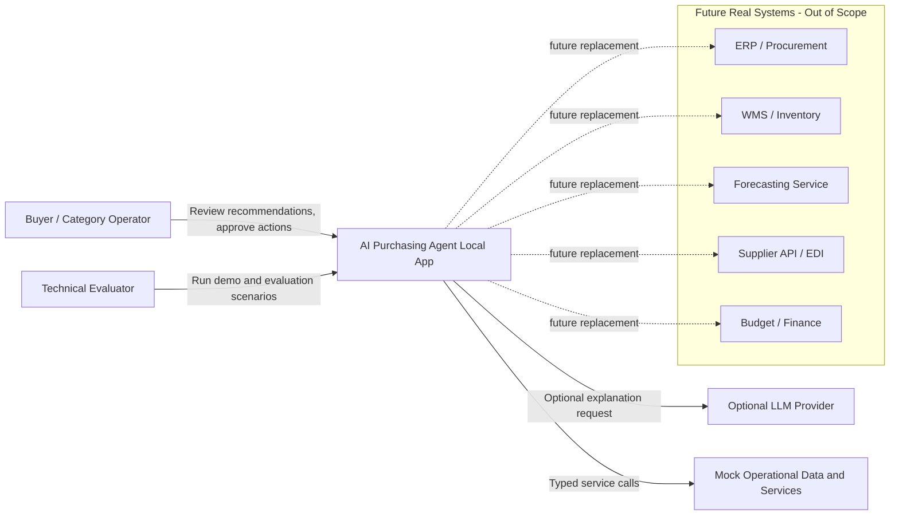
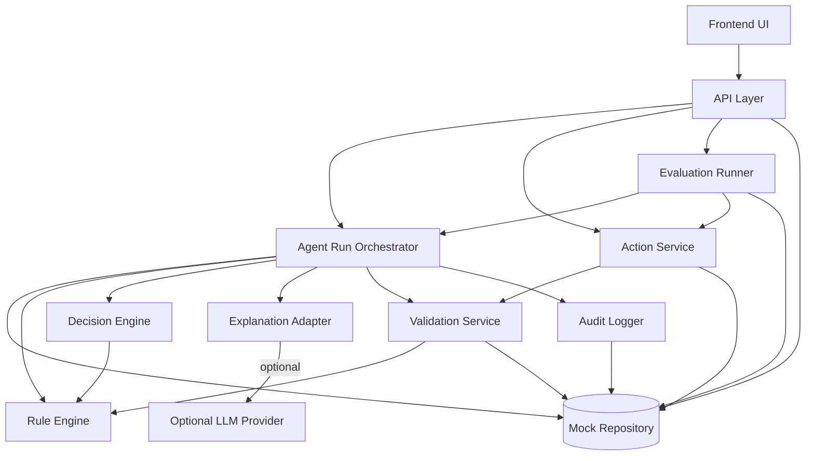
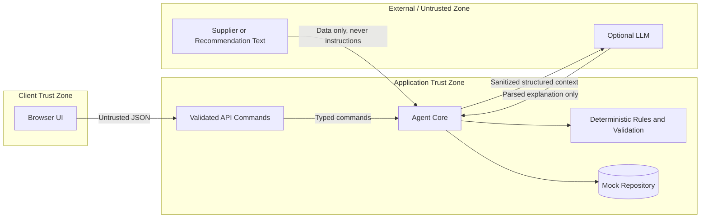
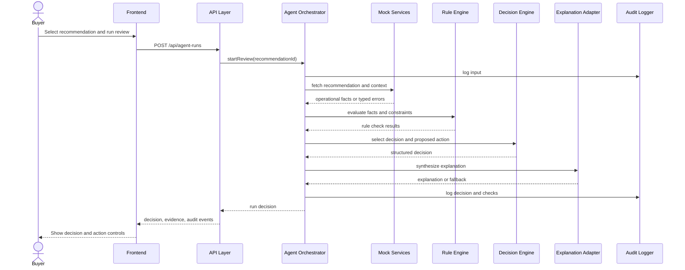
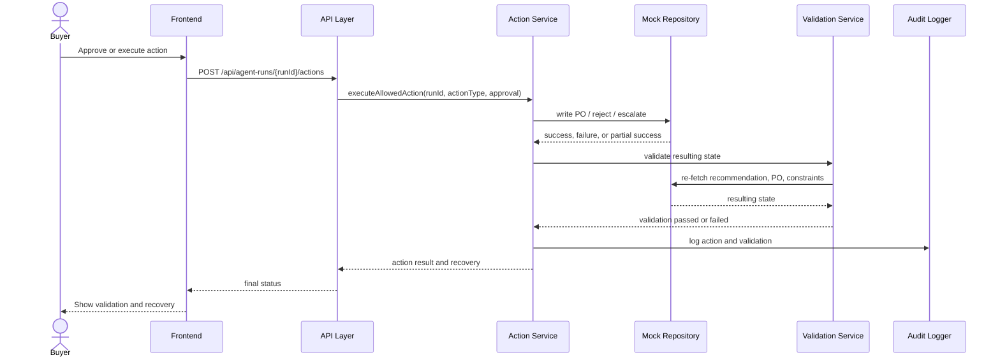
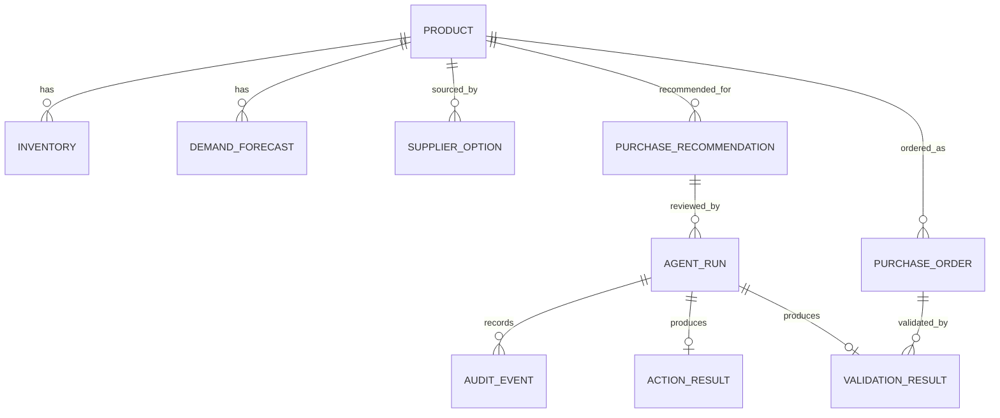

# Architecture Diagrams: AI Purchasing Agent

Source inputs: PRD and engineering specs under `docs/`.

## 1. System Context

## 2. Runtime Components

## 3. Trust Boundaries

## 4. Recommendation Review Sequence

## 5. Action and Validation Sequence

## 6. Data Ownership

